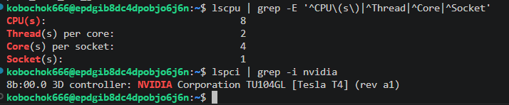
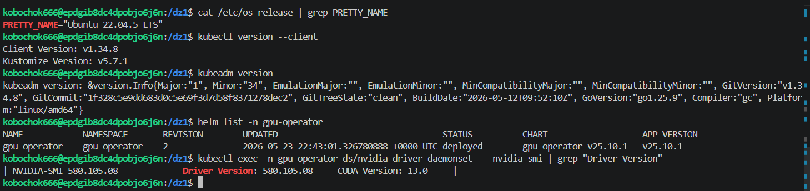
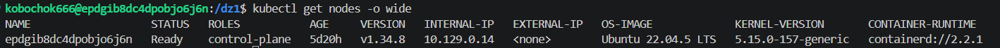
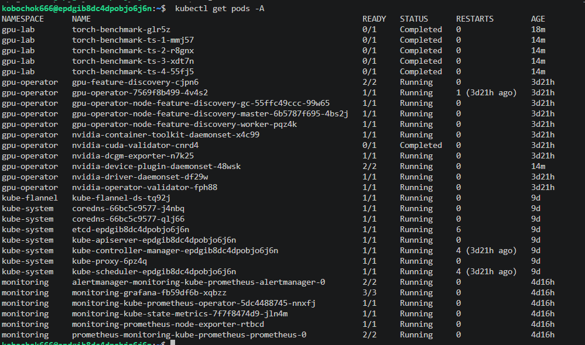
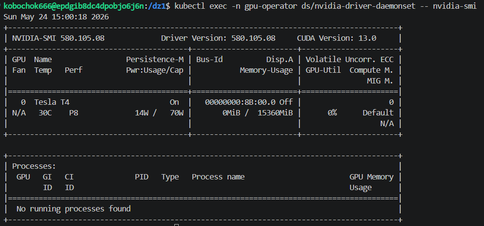
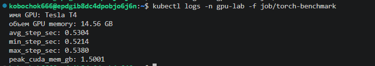
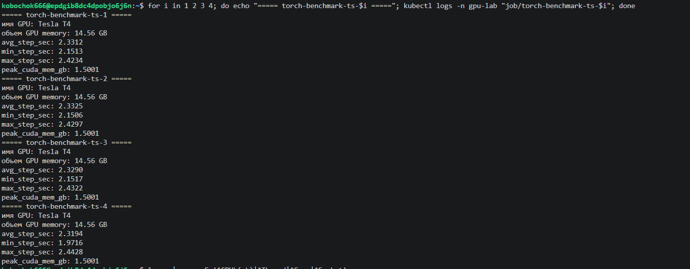
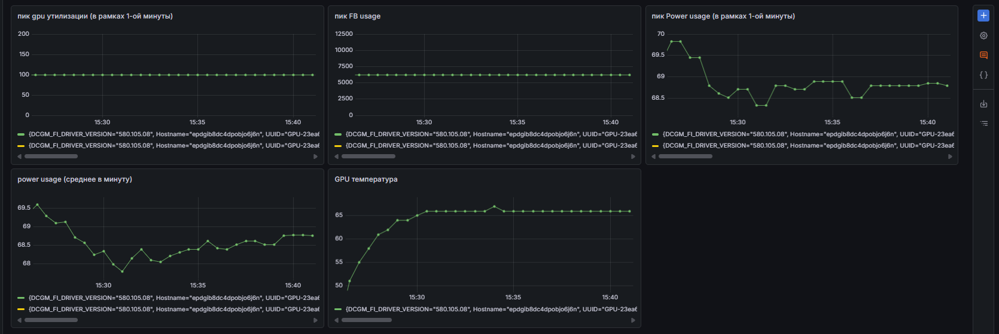
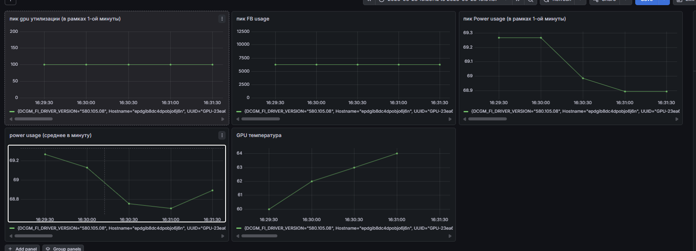

Параметры VM и модель GPU:  

Версии Ubuntu, Kubernetes, GPU Operator, драйвера NVIDIA и CUDA runtime:  
 

Скриншот или текстовый вывод kubectl get nodes -o wide:  

Cкриншот или текстовый вывод kubectl get pods -A;  

вывод nvidia-smi из pod:  

Результаты benchmark для exclusive, time-slicing и, если получилось, MPS:  
1-ый эксперимент:  
  
2-ой эксперимент:  
  

Графики или значения из Grafana по GPU utilization, memory usage и power usage:  
1 эксперимент:
  

2-ой:  

| Режим | Число pod | Kubernetes resource | Среднее время job (avg_step_sec) | Пик GPU util | Пик FB used | Комментарий |
|-------|-----------|---------------------|----------------------------------|--------------|--------------|--------------|
| Exclusive | 1 | `nvidia.com/gpu: 1` | 0.53 | 100 | 6gb | Один pod использует всю GPU. Память занята ~6 ГБ |
| Time-slicing | 4 | `nvidia.com/gpu.shared: 4` | ~2,328025 | 100 | 6gb | 4 параллельных pod. Каждый получил ~1.5 ГБ видеопамяти (всего 6). |

Как видно, Exclusive примерно в 4 раза и быстрее, чем Time-slicing, явно дело состоит в задаче, но в экспенрименте, который я поставил именно так. Скорее всего это связано с объемом данных для эксперимента (матрицы для перемножения слишком большие, например, и 1.5 гига VRAM сильно хуже справляются), возможно накладные разходы на переключение контекста тоже сыграли роль значительную

ВОПРОСЫ:  
Почему в exclusive одна job обычно выполняется быстрее?
Потому что pod получает полный доступ ко всем вычислительным ресурсам GPU (ядра, память, кэш) без конкуренции с другими задачами.

Почему в time-slicing можно запустить несколько pod на одной GPU?
Device plugin делит GPU по времени (тайм-слайсы) и ограничивает память, создавая видимость нескольких логических устройств.

Какие риски появляются при разделении одной GPU между несколькими pod?
Рост latency каждого pod, возможные Out-of-Memory ошибки, непредсказуемое время выполнения, конфликты при интенсивном использовании памяти.

Чем MPS концептуально отличается от обычного time-slicing?
Time-slicing - последовательное исполнение (переключение по времени). MPS - параллельное исполнение с разделением на уровне CUDA-ядер, но с меньшей изоляцией и возможными проблемами стабильности.

Какой режим вы бы выбрали для интерактивного JupyterLab, а какой для batch-задачи?
JupyterLab - exclusive (нужна отзывчивость и предсказуемость).
Batch-задачи - time-slicing (выше утилизация GPU, если задачи не критичны к задержкам).